[中文文档](https://github.com/nebula-beta/PatchMatch/blob/master/PatchMatch%E4%B8%AD%E6%96%87%E7%89%88%E6%8A%A5%E5%91%8A.pdf)
## Introuction
PatchMatch is the state-of-the-art stereo match algorithm framework.

Source code for the paper[1] and it's variants are implemented. The major difference between raw PatchMatch method and it's variants is the propagation way.

+ raw(the origin propgation way of PatchMatch)[1].
+ rows cols sweep(rows sweep, cols sweep, reverse rows sweep, reverse cols sweep)[2].
+ red black(split pixels to red and black, each turn traverse the red pixels or black ones respectively)[3].
	

Some experiments results are listed follwing.

## Experiments
 

We experiment on Aloe image of Middlebury dataset 2006. And the left and right disparity map show above.

### Experiment of different propagation way
This experiment explore the the affects of different propagation way of PatchMatch.

+ raw[1]
+ rows cols sweep[2]
+ red black[3].

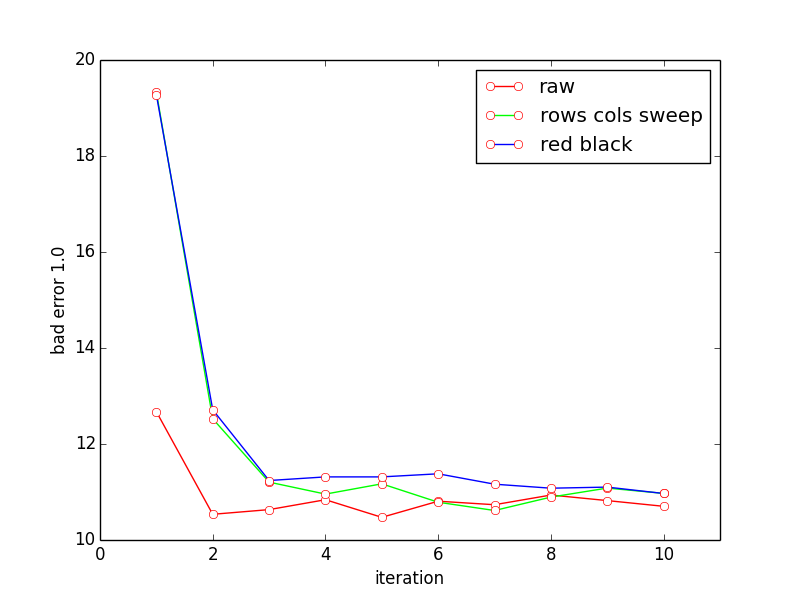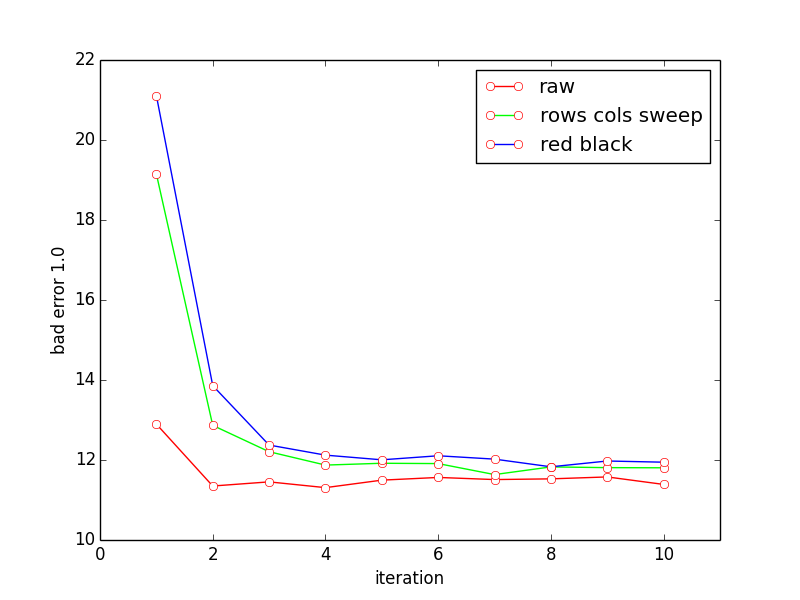

Left and right image show the affects of different propagation way of the left and right disparity respectively. The horizontal axis is the number of iterations, and the vertical axis is bad error 1.0 rate

We can see, raw propagation way is the best(red line), 2 iterations converge; Rows cols sweep propagation way is the second(green line), 3 iterations converge; Red black propagation way is the worse(blue line), also 3 iterations converge, but worse bad error 1.0 rate. 

The figure below shows the disparity map obtained using different propagation methods. From top to bottom, raw、rows cols sweep and red black respectively. It can be seen that there are no such big differences between in these disparitp map in visual sense.

 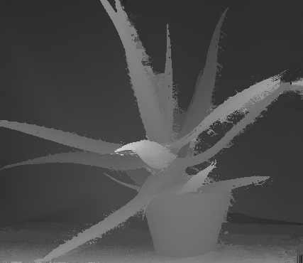
 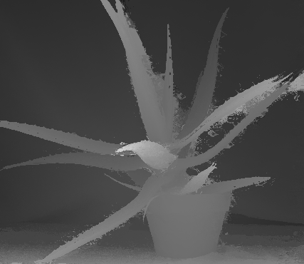
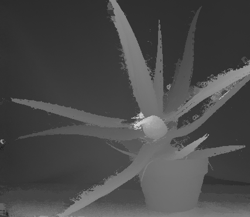 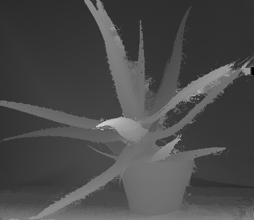

### Experiment of different steps of PatchMatch
	
This experiment explore the the affects of different steps of PatchMatch.
Left image is left disparity map comparison and right image is right disparity map comparison.

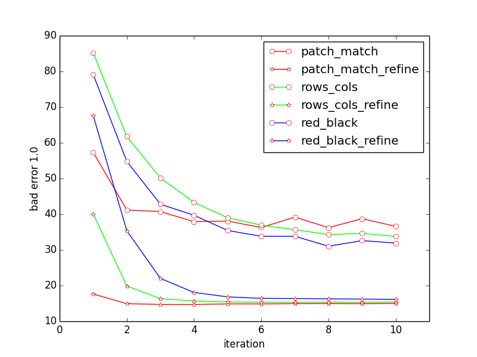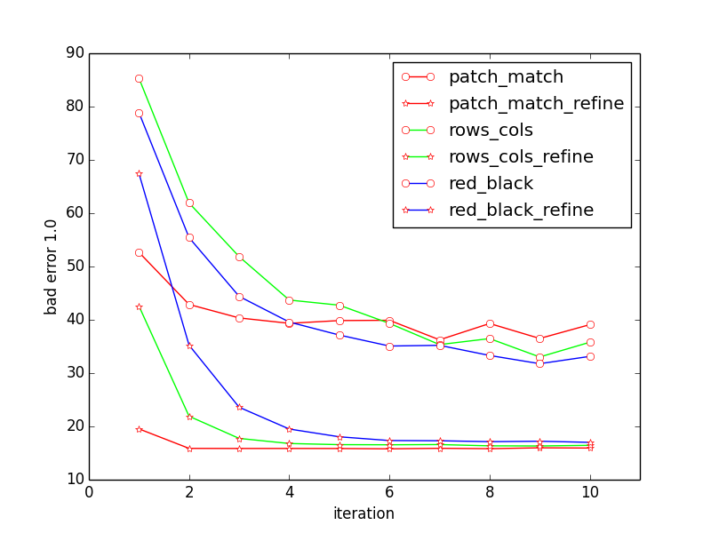

The images above show the PatchMatch has plane refinement or not, obviously, plane refinement has sufficient effect, reduce about 20%-30% bad error 1.0. This is obvious, random initialization and spatial propagation lead to coarse results, which is the reason need to refine, plane refinement reduce bad error  a lot .

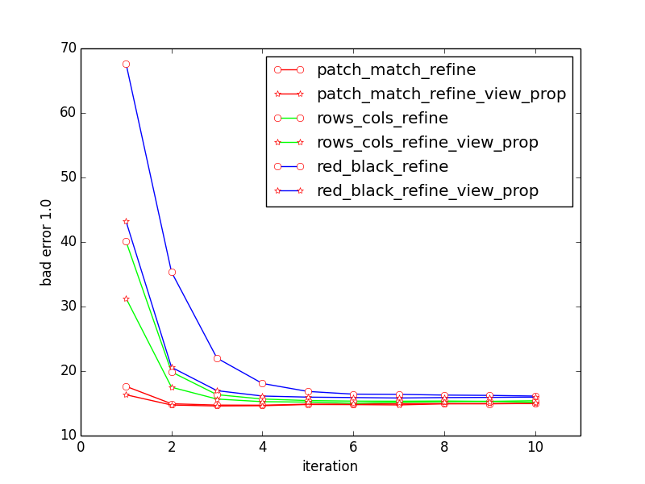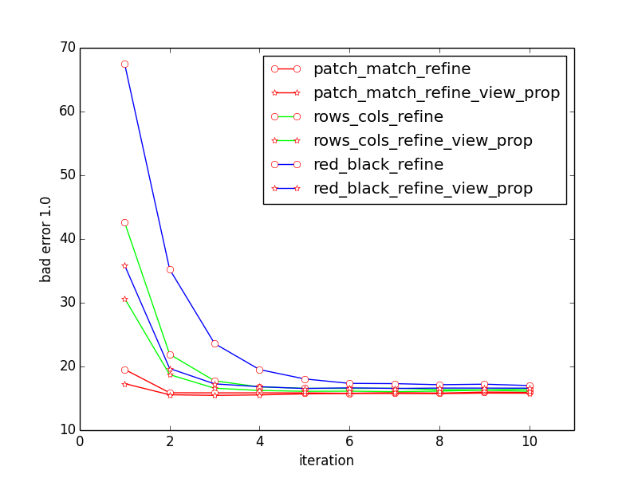

The images above show the PatchMatch has view propagation or not, obviously, view propagation has limited effect for raw PatchMatch, but for it's variants, has some effect in the first few iterations, but useless after 3 or 4 iterations for rwos cols sweep and 6 or 7 iterations for red black.

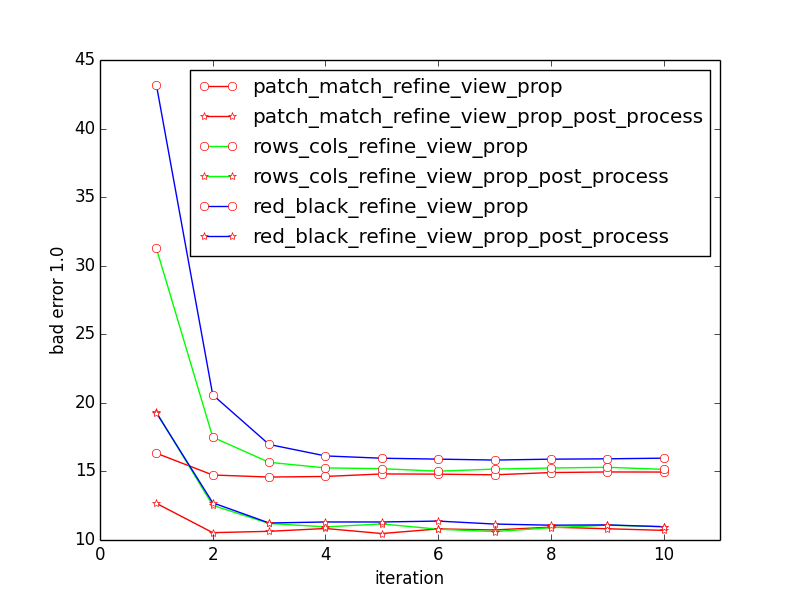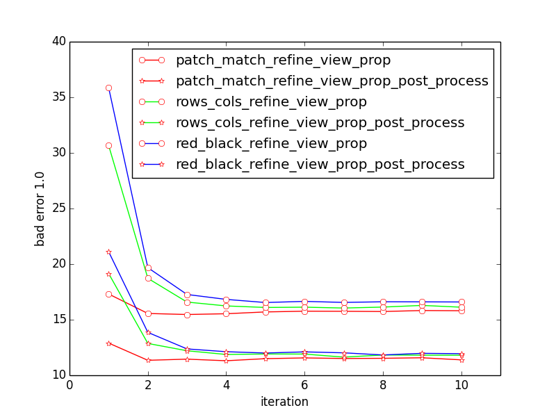

The images above show the PatchMatch has post-processing or not, obviously, post-processing improve the result a lot, reduce about 10% bad error 1.0.

### Experiment of different window size
	
In this example, weirdly, increasing the window size does not lower the bad error 1.0 rate. However, increasing the window size but improve the visual effect, just as the below:

The first row is the left and right disparity maps after 3 iterations with window size 11px; and the second row is the disparity maps with window size 31px. Both generate by the raw PatchMatch method.

Apparently, the second row better than the first one in visual, but about the same of the bad error 1.0 rate.

 

 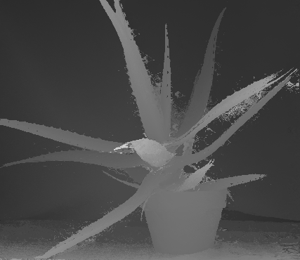

## Conclusions
In conclusion, the propagation way of raw PatchMatch method achieve the best result in all experiments. But, the raw propagation way is sequential implementation, unable to parallel. And it's variants can be implemented parallel but with slowly bad error 1.0 rate increase, so it some trade off. More analysis can refers to the report.

## Citations
[1] PatchMatch

[2] other propagation way

[3] Gipuma

## Appendix

Belowing table show the experiment on the full Middlebury 2006 datasets. We show the bad error 1.0 error of left and right disparity map for each method after each iteration.

<table>
<tr>
	<td> Method </td>
	<td> Dataset </td>
	<td> iteration 1 </td>
	<td> iteration 2 </td>
	<td> iteration 3 </td>
</tr>

<tr>
<td>spatial prop</td>
<td rowspan="5" style="text-align:center;vertical-align:middle;">Aloe</td>
<td style="text-align:center;vertical-align:middle;">(29.709475, 31.058928)</td>
<td style="text-align:center;vertical-align:middle;">(21.251978, 22.209633)</td>
<td style="text-align:center;vertical-align:middle;">(19.542376, 20.550035)</td>
</tr>
<tr>
<td>spatial prop + refine </td>
<td style="text-align:center;vertical-align:middle;">(16.692196, 18.488512)</td>
<td style="text-align:center;vertical-align:middle;">(14.312298, 15.287677)</td>
<td style="text-align:center;vertical-align:middle;">(14.354073, 15.190202)</td>
</tr>
<tr>
<td>spatial prop + refine + view prop</td>
<td style="text-align:center;vertical-align:middle;">(15.375657, 16.495981)</td>
<td style="text-align:center;vertical-align:middle;">(14.228748, 14.908539)</td>
<td style="text-align:center;vertical-align:middle;">(14.292044, 15.072473)</td>
</tr>
<tr>
<td>spatial prop + refine + view prop + post-process</td>
<td style="text-align:center;vertical-align:middle;">(11.802012, 12.540034)</td>
<td style="text-align:center;vertical-align:middle;">(10.94373, 11.446294)</td>
<td style="text-align:center;vertical-align:middle;">(10.891195, 11.403254)</td>
</tr>
<tr>
<td>spatial prop + post-process</td>
<td style="text-align:center;vertical-align:middle;">(22.747009, 24.128109)</td>
<td style="text-align:center;vertical-align:middle;">(15.845306, 15.868093)</td>
<td style="text-align:center;vertical-align:middle;">(14.344579, 14.820559)</td>
</tr>
<tr>
<td>spatial prop</td>
<td rowspan="5" style="text-align:center;vertical-align:middle;">Baby1</td>
<td style="text-align:center;vertical-align:middle;">(24.455206, 23.347948)</td>
<td style="text-align:center;vertical-align:middle;">(19.199659, 16.926903)</td>
<td style="text-align:center;vertical-align:middle;">(18.600222, 14.641058)</td>
</tr>
<tr>
<td>spatial prop + refine </td>
<td style="text-align:center;vertical-align:middle;">(15.36745, 11.954715)</td>
<td style="text-align:center;vertical-align:middle;">(13.823049, 11.59021)</td>
<td style="text-align:center;vertical-align:middle;">(13.98665, 11.461946)</td>
</tr>
<tr>
<td>spatial prop + refine + view prop</td>
<td style="text-align:center;vertical-align:middle;">(13.851188, 10.983574)</td>
<td style="text-align:center;vertical-align:middle;">(13.571755, 11.621622)</td>
<td style="text-align:center;vertical-align:middle;">(13.78313, 11.577776)</td>
</tr>
<tr>
<td>spatial prop + refine + view prop + post-process</td>
<td style="text-align:center;vertical-align:middle;">(6.998888, 6.645507)</td>
<td style="text-align:center;vertical-align:middle;">(7.326746, 6.557162)</td>
<td style="text-align:center;vertical-align:middle;">(7.392186, 6.872587)</td>
</tr>
<tr>
<td>spatial prop + post-process</td>
<td style="text-align:center;vertical-align:middle;">(18.411098, 16.426935)</td>
<td style="text-align:center;vertical-align:middle;">(11.928538, 11.911524)</td>
<td style="text-align:center;vertical-align:middle;">(11.646489, 10.438453)</td>
</tr>
<tr>
<td>spatial prop</td>
<td rowspan="5" style="text-align:center;vertical-align:middle;">Baby2</td>
<td style="text-align:center;vertical-align:middle;">(34.149597, 33.292976)</td>
<td style="text-align:center;vertical-align:middle;">(28.361364, 28.737648)</td>
<td style="text-align:center;vertical-align:middle;">(26.852955, 25.936785)</td>
</tr>
<tr>
<td>spatial prop + refine </td>
<td style="text-align:center;vertical-align:middle;">(21.204763, 20.40835)</td>
<td style="text-align:center;vertical-align:middle;">(20.299065, 20.469864)</td>
<td style="text-align:center;vertical-align:middle;">(20.571953, 20.521563)</td>
</tr>
<tr>
<td>spatial prop + refine + view prop</td>
<td style="text-align:center;vertical-align:middle;">(20.039265, 18.948368)</td>
<td style="text-align:center;vertical-align:middle;">(20.168837, 19.723841)</td>
<td style="text-align:center;vertical-align:middle;">(20.555592, 20.422092)</td>
</tr>
<tr>
<td>spatial prop + refine + view prop + post-process</td>
<td style="text-align:center;vertical-align:middle;">(17.720045, 15.941365)</td>
<td style="text-align:center;vertical-align:middle;">(16.873896, 15.592566)</td>
<td style="text-align:center;vertical-align:middle;">(16.345789, 16.430862)</td>
</tr>
<tr>
<td>spatial prop + post-process</td>
<td style="text-align:center;vertical-align:middle;">(29.752634, 26.355604)</td>
<td style="text-align:center;vertical-align:middle;">(23.667953, 24.80924)</td>
<td style="text-align:center;vertical-align:middle;">(22.91604, 22.402985)</td>
</tr>
<tr>
<td>spatial prop</td>
<td rowspan="5" style="text-align:center;vertical-align:middle;">Baby3</td>
<td style="text-align:center;vertical-align:middle;">(34.131363, 32.760838)</td>
<td style="text-align:center;vertical-align:middle;">(24.146824, 24.02746)</td>
<td style="text-align:center;vertical-align:middle;">(24.021894, 25.348507)</td>
</tr>
<tr>
<td>spatial prop + refine </td>
<td style="text-align:center;vertical-align:middle;">(22.96246, 20.44035)</td>
<td style="text-align:center;vertical-align:middle;">(21.825098, 19.087143)</td>
<td style="text-align:center;vertical-align:middle;">(21.898077, 18.797699)</td>
</tr>
<tr>
<td>spatial prop + refine + view prop</td>
<td style="text-align:center;vertical-align:middle;">(21.933329, 18.938091)</td>
<td style="text-align:center;vertical-align:middle;">(21.304348, 19.335148)</td>
<td style="text-align:center;vertical-align:middle;">(21.682232, 19.215164)</td>
</tr>
<tr>
<td>spatial prop + refine + view prop + post-process</td>
<td style="text-align:center;vertical-align:middle;">(17.793308, 13.296432)</td>
<td style="text-align:center;vertical-align:middle;">(16.283628, 13.318696)</td>
<td style="text-align:center;vertical-align:middle;">(17.730843, 13.870369)</td>
</tr>
<tr>
<td>spatial prop + post-process</td>
<td style="text-align:center;vertical-align:middle;">(28.80945, 25.135754)</td>
<td style="text-align:center;vertical-align:middle;">(16.604614, 17.79269)</td>
<td style="text-align:center;vertical-align:middle;">(19.561506, 17.868761)</td>
</tr>
<tr>
<td>spatial prop</td>
<td rowspan="5" style="text-align:center;vertical-align:middle;">Bowling1</td>
<td style="text-align:center;vertical-align:middle;">(46.957027, 44.483765)</td>
<td style="text-align:center;vertical-align:middle;">(41.188023, 39.243633)</td>
<td style="text-align:center;vertical-align:middle;">(39.154839, 38.336899)</td>
</tr>
<tr>
<td>spatial prop + refine </td>
<td style="text-align:center;vertical-align:middle;">(35.078747, 33.535549)</td>
<td style="text-align:center;vertical-align:middle;">(35.370407, 33.695637)</td>
<td style="text-align:center;vertical-align:middle;">(35.553825, 33.927021)</td>
</tr>
<tr>
<td>spatial prop + refine + view prop</td>
<td style="text-align:center;vertical-align:middle;">(34.398212, 32.365028)</td>
<td style="text-align:center;vertical-align:middle;">(34.798756, 33.106487)</td>
<td style="text-align:center;vertical-align:middle;">(35.381424, 33.975632)</td>
</tr>
<tr>
<td>spatial prop + refine + view prop + post-process</td>
<td style="text-align:center;vertical-align:middle;">(31.464773, 29.441311)</td>
<td style="text-align:center;vertical-align:middle;">(31.657917, 30.823126)</td>
<td style="text-align:center;vertical-align:middle;">(31.974205, 30.371378)</td>
</tr>
<tr>
<td>spatial prop + post-process</td>
<td style="text-align:center;vertical-align:middle;">(42.914642, 39.038174)</td>
<td style="text-align:center;vertical-align:middle;">(36.139088, 33.797394)</td>
<td style="text-align:center;vertical-align:middle;">(35.211613, 33.755264)</td>
</tr>
<tr>
<td>spatial prop</td>
<td rowspan="5" style="text-align:center;vertical-align:middle;">Bowling2</td>
<td style="text-align:center;vertical-align:middle;">(37.061802, 36.023426)</td>
<td style="text-align:center;vertical-align:middle;">(29.018974, 28.662682)</td>
<td style="text-align:center;vertical-align:middle;">(28.951864, 26.819595)</td>
</tr>
<tr>
<td>spatial prop + refine </td>
<td style="text-align:center;vertical-align:middle;">(24.304192, 22.713684)</td>
<td style="text-align:center;vertical-align:middle;">(23.259716, 21.88335)</td>
<td style="text-align:center;vertical-align:middle;">(23.317675, 21.780855)</td>
</tr>
<tr>
<td>spatial prop + refine + view prop</td>
<td style="text-align:center;vertical-align:middle;">(23.75511, 21.735708)</td>
<td style="text-align:center;vertical-align:middle;">(23.296322, 21.725338)</td>
<td style="text-align:center;vertical-align:middle;">(23.446404, 21.877249)</td>
</tr>
<tr>
<td>spatial prop + refine + view prop + post-process</td>
<td style="text-align:center;vertical-align:middle;">(19.300837, 15.094869)</td>
<td style="text-align:center;vertical-align:middle;">(18.617535, 15.266914)</td>
<td style="text-align:center;vertical-align:middle;">(18.122141, 16.199743)</td>
</tr>
<tr>
<td>spatial prop + post-process</td>
<td style="text-align:center;vertical-align:middle;">(33.248123, 27.449209)</td>
<td style="text-align:center;vertical-align:middle;">(25.30047, 22.458666)</td>
<td style="text-align:center;vertical-align:middle;">(23.439083, 20.097614)</td>
</tr>
<tr>
<td>spatial prop</td>
<td rowspan="5" style="text-align:center;vertical-align:middle;">Cloth1</td>
<td style="text-align:center;vertical-align:middle;">(19.858059, 17.288223)</td>
<td style="text-align:center;vertical-align:middle;">(12.652148, 11.436905)</td>
<td style="text-align:center;vertical-align:middle;">(12.703999, 9.885929)</td>
</tr>
<tr>
<td>spatial prop + refine </td>
<td style="text-align:center;vertical-align:middle;">(9.953982, 7.454145)</td>
<td style="text-align:center;vertical-align:middle;">(9.242984, 7.135265)</td>
<td style="text-align:center;vertical-align:middle;">(9.3065, 7.119709)</td>
</tr>
<tr>
<td>spatial prop + refine + view prop</td>
<td style="text-align:center;vertical-align:middle;">(9.824357, 6.982306)</td>
<td style="text-align:center;vertical-align:middle;">(9.288353, 7.155357)</td>
<td style="text-align:center;vertical-align:middle;">(9.24752, 7.141746)</td>
</tr>
<tr>
<td>spatial prop + refine + view prop + post-process</td>
<td style="text-align:center;vertical-align:middle;">(5.543457, 2.783719)</td>
<td style="text-align:center;vertical-align:middle;">(5.102729, 2.588632)</td>
<td style="text-align:center;vertical-align:middle;">(5.01912, 2.352064)</td>
</tr>
<tr>
<td>spatial prop + post-process</td>
<td style="text-align:center;vertical-align:middle;">(13.002139, 8.035518)</td>
<td style="text-align:center;vertical-align:middle;">(8.27403, 4.290622)</td>
<td style="text-align:center;vertical-align:middle;">(7.543587, 2.992417)</td>
</tr>
<tr>
<td>spatial prop</td>
<td rowspan="5" style="text-align:center;vertical-align:middle;">Cloth2</td>
<td style="text-align:center;vertical-align:middle;">(35.623867, 33.884277)</td>
<td style="text-align:center;vertical-align:middle;">(23.739468, 22.534174)</td>
<td style="text-align:center;vertical-align:middle;">(21.909992, 21.604769)</td>
</tr>
<tr>
<td>spatial prop + refine </td>
<td style="text-align:center;vertical-align:middle;">(15.675052, 15.208164)</td>
<td style="text-align:center;vertical-align:middle;">(14.769989, 14.540291)</td>
<td style="text-align:center;vertical-align:middle;">(14.718806, 14.478497)</td>
</tr>
<tr>
<td>spatial prop + refine + view prop</td>
<td style="text-align:center;vertical-align:middle;">(15.159478, 14.738156)</td>
<td style="text-align:center;vertical-align:middle;">(14.607079, 14.327445)</td>
<td style="text-align:center;vertical-align:middle;">(14.545284, 14.509706)</td>
</tr>
<tr>
<td>spatial prop + refine + view prop + post-process</td>
<td style="text-align:center;vertical-align:middle;">(11.129767, 9.776544)</td>
<td style="text-align:center;vertical-align:middle;">(10.519942, 10.202859)</td>
<td style="text-align:center;vertical-align:middle;">(10.130454, 9.846452)</td>
</tr>
<tr>
<td>spatial prop + post-process</td>
<td style="text-align:center;vertical-align:middle;">(27.581299, 26.129456)</td>
<td style="text-align:center;vertical-align:middle;">(15.343612, 15.861682)</td>
<td style="text-align:center;vertical-align:middle;">(15.328631, 14.488483)</td>
</tr>
<tr>
<td>spatial prop</td>
<td rowspan="5" style="text-align:center;vertical-align:middle;">Cloth3</td>
<td style="text-align:center;vertical-align:middle;">(23.841467, 20.435543)</td>
<td style="text-align:center;vertical-align:middle;">(15.433275, 13.716378)</td>
<td style="text-align:center;vertical-align:middle;">(15.534384, 13.401387)</td>
</tr>
<tr>
<td>spatial prop + refine </td>
<td style="text-align:center;vertical-align:middle;">(11.570419, 8.885216)</td>
<td style="text-align:center;vertical-align:middle;">(10.456932, 8.181347)</td>
<td style="text-align:center;vertical-align:middle;">(10.506189, 8.484672)</td>
</tr>
<tr>
<td>spatial prop + refine + view prop</td>
<td style="text-align:center;vertical-align:middle;">(11.127747, 8.419859)</td>
<td style="text-align:center;vertical-align:middle;">(10.441377, 8.248104)</td>
<td style="text-align:center;vertical-align:middle;">(10.594336, 8.109405)</td>
</tr>
<tr>
<td>spatial prop + refine + view prop + post-process</td>
<td style="text-align:center;vertical-align:middle;">(6.663426, 3.88554)</td>
<td style="text-align:center;vertical-align:middle;">(6.134552, 3.753322)</td>
<td style="text-align:center;vertical-align:middle;">(6.074924, 3.921187)</td>
</tr>
<tr>
<td>spatial prop + post-process</td>
<td style="text-align:center;vertical-align:middle;">(16.977121, 13.214077)</td>
<td style="text-align:center;vertical-align:middle;">(10.651371, 6.916197)</td>
<td style="text-align:center;vertical-align:middle;">(9.162616, 6.181865)</td>
</tr>
<tr>
<td>spatial prop</td>
<td rowspan="5" style="text-align:center;vertical-align:middle;">Cloth4</td>
<td style="text-align:center;vertical-align:middle;">(29.565571, 30.478746)</td>
<td style="text-align:center;vertical-align:middle;">(19.947569, 22.840647)</td>
<td style="text-align:center;vertical-align:middle;">(19.334, 20.401972)</td>
</tr>
<tr>
<td>spatial prop + refine </td>
<td style="text-align:center;vertical-align:middle;">(15.517134, 17.337244)</td>
<td style="text-align:center;vertical-align:middle;">(15.243118, 16.412832)</td>
<td style="text-align:center;vertical-align:middle;">(15.347357, 16.532677)</td>
</tr>
<tr>
<td>spatial prop + refine + view prop</td>
<td style="text-align:center;vertical-align:middle;">(15.882279, 16.813557)</td>
<td style="text-align:center;vertical-align:middle;">(15.328007, 16.538294)</td>
<td style="text-align:center;vertical-align:middle;">(15.203171, 16.705574)</td>
</tr>
<tr>
<td>spatial prop + refine + view prop + post-process</td>
<td style="text-align:center;vertical-align:middle;">(12.021722, 11.770801)</td>
<td style="text-align:center;vertical-align:middle;">(12.081018, 11.772674)</td>
<td style="text-align:center;vertical-align:middle;">(12.079146, 11.611634)</td>
</tr>
<tr>
<td>spatial prop + post-process</td>
<td style="text-align:center;vertical-align:middle;">(23.216404, 23.501654)</td>
<td style="text-align:center;vertical-align:middle;">(13.929842, 14.887336)</td>
<td style="text-align:center;vertical-align:middle;">(13.659572, 14.429187)</td>
</tr>
<tr>
<td>spatial prop</td>
<td rowspan="5" style="text-align:center;vertical-align:middle;">Flowerpots</td>
<td style="text-align:center;vertical-align:middle;">(50.201622, 47.636837)</td>
<td style="text-align:center;vertical-align:middle;">(42.180717, 42.48624)</td>
<td style="text-align:center;vertical-align:middle;">(41.02047, 40.958008)</td>
</tr>
<tr>
<td>spatial prop + refine </td>
<td style="text-align:center;vertical-align:middle;">(36.393715, 34.839508)</td>
<td style="text-align:center;vertical-align:middle;">(35.506214, 34.621189)</td>
<td style="text-align:center;vertical-align:middle;">(35.650936, 34.781372)</td>
</tr>
<tr>
<td>spatial prop + refine + view prop</td>
<td style="text-align:center;vertical-align:middle;">(35.962643, 33.867275)</td>
<td style="text-align:center;vertical-align:middle;">(35.73814, 34.589027)</td>
<td style="text-align:center;vertical-align:middle;">(35.707836, 34.756634)</td>
</tr>
<tr>
<td>spatial prop + refine + view prop + post-process</td>
<td style="text-align:center;vertical-align:middle;">(32.776299, 32.390995)</td>
<td style="text-align:center;vertical-align:middle;">(32.31554, 32.183189)</td>
<td style="text-align:center;vertical-align:middle;">(32.42934, 33.279732)</td>
</tr>
<tr>
<td>spatial prop + post-process</td>
<td style="text-align:center;vertical-align:middle;">(47.362236, 48.181087)</td>
<td style="text-align:center;vertical-align:middle;">(39.495331, 39.732204)</td>
<td style="text-align:center;vertical-align:middle;">(38.98262, 40.094627)</td>
</tr>
<tr>
<td>spatial prop</td>
<td rowspan="5" style="text-align:center;vertical-align:middle;">Lampshade1</td>
<td style="text-align:center;vertical-align:middle;">(50.149178, 53.37994)</td>
<td style="text-align:center;vertical-align:middle;">(43.596531, 43.33812)</td>
<td style="text-align:center;vertical-align:middle;">(40.674114, 43.798763)</td>
</tr>
<tr>
<td>spatial prop + refine </td>
<td style="text-align:center;vertical-align:middle;">(36.449036, 37.001434)</td>
<td style="text-align:center;vertical-align:middle;">(34.947258, 34.910431)</td>
<td style="text-align:center;vertical-align:middle;">(36.237438, 35.269333)</td>
</tr>
<tr>
<td>spatial prop + refine + view prop</td>
<td style="text-align:center;vertical-align:middle;">(35.886024, 34.017227)</td>
<td style="text-align:center;vertical-align:middle;">(35.095188, 34.343674)</td>
<td style="text-align:center;vertical-align:middle;">(36.045189, 34.20261)</td>
</tr>
<tr>
<td>spatial prop + refine + view prop + post-process</td>
<td style="text-align:center;vertical-align:middle;">(32.424316, 29.446352)</td>
<td style="text-align:center;vertical-align:middle;">(31.288309, 27.810999)</td>
<td style="text-align:center;vertical-align:middle;">(31.484926, 28.923912)</td>
</tr>
<tr>
<td>spatial prop + post-process</td>
<td style="text-align:center;vertical-align:middle;">(45.849197, 46.369766)</td>
<td style="text-align:center;vertical-align:middle;">(41.365707, 39.609264)</td>
<td style="text-align:center;vertical-align:middle;">(39.161724, 37.864052)</td>
</tr>
<tr>
<td>spatial prop</td>
<td rowspan="5" style="text-align:center;vertical-align:middle;">Lampshade2</td>
<td style="text-align:center;vertical-align:middle;">(58.204231, 62.856251)</td>
<td style="text-align:center;vertical-align:middle;">(47.467697, 50.835155)</td>
<td style="text-align:center;vertical-align:middle;">(46.292366, 50.348293)</td>
</tr>
<tr>
<td>spatial prop + refine </td>
<td style="text-align:center;vertical-align:middle;">(40.721554, 42.039822)</td>
<td style="text-align:center;vertical-align:middle;">(39.519382, 41.094189)</td>
<td style="text-align:center;vertical-align:middle;">(39.476936, 41.066101)</td>
</tr>
<tr>
<td>spatial prop + refine + view prop</td>
<td style="text-align:center;vertical-align:middle;">(39.280945, 39.314026)</td>
<td style="text-align:center;vertical-align:middle;">(39.751575, 40.486862)</td>
<td style="text-align:center;vertical-align:middle;">(39.625492, 40.94376)</td>
</tr>
<tr>
<td>spatial prop + refine + view prop + post-process</td>
<td style="text-align:center;vertical-align:middle;">(33.56345, 32.164036)</td>
<td style="text-align:center;vertical-align:middle;">(33.766308, 33.695148)</td>
<td style="text-align:center;vertical-align:middle;">(34.504089, 33.062229)</td>
</tr>
<tr>
<td>spatial prop + post-process</td>
<td style="text-align:center;vertical-align:middle;">(56.212471, 54.356781)</td>
<td style="text-align:center;vertical-align:middle;">(46.123837, 43.713253)</td>
<td style="text-align:center;vertical-align:middle;">(42.806316, 41.38818)</td>
</tr>
<tr>
<td>spatial prop</td>
<td rowspan="5" style="text-align:center;vertical-align:middle;">Midd1</td>
<td style="text-align:center;vertical-align:middle;">(61.673351, 62.588783)</td>
<td style="text-align:center;vertical-align:middle;">(57.00901, 56.19936)</td>
<td style="text-align:center;vertical-align:middle;">(55.084568, 57.122929)</td>
</tr>
<tr>
<td>spatial prop + refine </td>
<td style="text-align:center;vertical-align:middle;">(53.353676, 53.958153)</td>
<td style="text-align:center;vertical-align:middle;">(53.154316, 53.030514)</td>
<td style="text-align:center;vertical-align:middle;">(53.366463, 53.240337)</td>
</tr>
<tr>
<td>spatial prop + refine + view prop</td>
<td style="text-align:center;vertical-align:middle;">(53.546062, 52.996803)</td>
<td style="text-align:center;vertical-align:middle;">(53.19849, 52.81604)</td>
<td style="text-align:center;vertical-align:middle;">(53.292065, 53.035164)</td>
</tr>
<tr>
<td>spatial prop + refine + view prop + post-process</td>
<td style="text-align:center;vertical-align:middle;">(53.420517, 53.325779)</td>
<td style="text-align:center;vertical-align:middle;">(53.040394, 52.651554)</td>
<td style="text-align:center;vertical-align:middle;">(53.01017, 53.00552)</td>
</tr>
<tr>
<td>spatial prop + post-process</td>
<td style="text-align:center;vertical-align:middle;">(58.911362, 59.065388)</td>
<td style="text-align:center;vertical-align:middle;">(54.058704, 55.516418)</td>
<td style="text-align:center;vertical-align:middle;">(53.42226, 54.104038)</td>
</tr>
<tr>
<td>spatial prop</td>
<td rowspan="5" style="text-align:center;vertical-align:middle;">Midd2</td>
<td style="text-align:center;vertical-align:middle;">(65.702408, 62.091476)</td>
<td style="text-align:center;vertical-align:middle;">(59.115532, 57.283634)</td>
<td style="text-align:center;vertical-align:middle;">(59.286606, 57.129787)</td>
</tr>
<tr>
<td>spatial prop + refine </td>
<td style="text-align:center;vertical-align:middle;">(55.724384, 54.551826)</td>
<td style="text-align:center;vertical-align:middle;">(55.03653, 54.735966)</td>
<td style="text-align:center;vertical-align:middle;">(55.05138, 54.674191)</td>
</tr>
<tr>
<td>spatial prop + refine + view prop</td>
<td style="text-align:center;vertical-align:middle;">(55.196911, 53.95842)</td>
<td style="text-align:center;vertical-align:middle;">(54.824474, 54.121178)</td>
<td style="text-align:center;vertical-align:middle;">(54.961685, 54.482922)</td>
</tr>
<tr>
<td>spatial prop + refine + view prop + post-process</td>
<td style="text-align:center;vertical-align:middle;">(52.804276, 52.525097)</td>
<td style="text-align:center;vertical-align:middle;">(53.235519, 52.847637)</td>
<td style="text-align:center;vertical-align:middle;">(52.744282, 52.623108)</td>
</tr>
<tr>
<td>spatial prop + post-process</td>
<td style="text-align:center;vertical-align:middle;">(60.595783, 61.597267)</td>
<td style="text-align:center;vertical-align:middle;">(54.278587, 55.284229)</td>
<td style="text-align:center;vertical-align:middle;">(54.367687, 54.730621)</td>
</tr>
<tr>
<td>spatial prop</td>
<td rowspan="5" style="text-align:center;vertical-align:middle;">Monopoly</td>
<td style="text-align:center;vertical-align:middle;">(53.665424, 57.072784)</td>
<td style="text-align:center;vertical-align:middle;">(43.753891, 42.409859)</td>
<td style="text-align:center;vertical-align:middle;">(43.684338, 43.326214)</td>
</tr>
<tr>
<td>spatial prop + refine </td>
<td style="text-align:center;vertical-align:middle;">(37.668232, 38.303337)</td>
<td style="text-align:center;vertical-align:middle;">(36.920872, 37.480324)</td>
<td style="text-align:center;vertical-align:middle;">(37.247879, 37.318039)</td>
</tr>
<tr>
<td>spatial prop + refine + view prop</td>
<td style="text-align:center;vertical-align:middle;">(37.787811, 36.672565)</td>
<td style="text-align:center;vertical-align:middle;">(36.570679, 36.349827)</td>
<td style="text-align:center;vertical-align:middle;">(36.953815, 37.046551)</td>
</tr>
<tr>
<td>spatial prop + refine + view prop + post-process</td>
<td style="text-align:center;vertical-align:middle;">(34.906349, 35.612835)</td>
<td style="text-align:center;vertical-align:middle;">(35.147335, 36.153378)</td>
<td style="text-align:center;vertical-align:middle;">(35.02837, 35.361481)</td>
</tr>
<tr>
<td>spatial prop + post-process</td>
<td style="text-align:center;vertical-align:middle;">(47.620644, 47.265572)</td>
<td style="text-align:center;vertical-align:middle;">(37.208836, 37.350376)</td>
<td style="text-align:center;vertical-align:middle;">(39.613201, 39.494846)</td>
</tr>
<tr>
<td>spatial prop</td>
<td rowspan="5" style="text-align:center;vertical-align:middle;">Plastic</td>
<td style="text-align:center;vertical-align:middle;">(64.571594, 65.97406)</td>
<td style="text-align:center;vertical-align:middle;">(62.158966, 60.612103)</td>
<td style="text-align:center;vertical-align:middle;">(62.489937, 61.272121)</td>
</tr>
<tr>
<td>spatial prop + refine </td>
<td style="text-align:center;vertical-align:middle;">(59.148296, 59.131683)</td>
<td style="text-align:center;vertical-align:middle;">(59.510574, 59.004536)</td>
<td style="text-align:center;vertical-align:middle;">(59.698421, 59.415371)</td>
</tr>
<tr>
<td>spatial prop + refine + view prop</td>
<td style="text-align:center;vertical-align:middle;">(59.514408, 57.790558)</td>
<td style="text-align:center;vertical-align:middle;">(59.255638, 58.081272)</td>
<td style="text-align:center;vertical-align:middle;">(59.329117, 59.028175)</td>
</tr>
<tr>
<td>spatial prop + refine + view prop + post-process</td>
<td style="text-align:center;vertical-align:middle;">(54.136478, 57.594402)</td>
<td style="text-align:center;vertical-align:middle;">(53.966518, 57.583542)</td>
<td style="text-align:center;vertical-align:middle;">(52.964668, 57.729858)</td>
</tr>
<tr>
<td>spatial prop + post-process</td>
<td style="text-align:center;vertical-align:middle;">(60.922626, 63.753117)</td>
<td style="text-align:center;vertical-align:middle;">(56.498627, 60.539902)</td>
<td style="text-align:center;vertical-align:middle;">(54.763912, 59.389175)</td>
</tr>
<tr>
<td>spatial prop</td>
<td rowspan="5" style="text-align:center;vertical-align:middle;">Rocks1</td>
<td style="text-align:center;vertical-align:middle;">(28.354214, 28.638474)</td>
<td style="text-align:center;vertical-align:middle;">(19.895071, 19.12496)</td>
<td style="text-align:center;vertical-align:middle;">(18.710335, 18.839428)</td>
</tr>
<tr>
<td>spatial prop + refine </td>
<td style="text-align:center;vertical-align:middle;">(15.775517, 14.709062)</td>
<td style="text-align:center;vertical-align:middle;">(15.052464, 13.846105)</td>
<td style="text-align:center;vertical-align:middle;">(15.099523, 14.23275)</td>
</tr>
<tr>
<td>spatial prop + refine + view prop</td>
<td style="text-align:center;vertical-align:middle;">(15.526868, 13.869635)</td>
<td style="text-align:center;vertical-align:middle;">(14.971066, 13.648967)</td>
<td style="text-align:center;vertical-align:middle;">(14.976789, 13.920508)</td>
</tr>
<tr>
<td>spatial prop + refine + view prop + post-process</td>
<td style="text-align:center;vertical-align:middle;">(10.846423, 10.840699)</td>
<td style="text-align:center;vertical-align:middle;">(10.450238, 10.827345)</td>
<td style="text-align:center;vertical-align:middle;">(10.305882, 10.721781)</td>
</tr>
<tr>
<td>spatial prop + post-process</td>
<td style="text-align:center;vertical-align:middle;">(21.590462, 19.673767)</td>
<td style="text-align:center;vertical-align:middle;">(13.442925, 13.013673)</td>
<td style="text-align:center;vertical-align:middle;">(13.318919, 13.54531)</td>
</tr>
<tr>
<td>spatial prop</td>
<td rowspan="5" style="text-align:center;vertical-align:middle;">Rocks2</td>
<td style="text-align:center;vertical-align:middle;">(23.88744, 24.211765)</td>
<td style="text-align:center;vertical-align:middle;">(18.449602, 15.973927)</td>
<td style="text-align:center;vertical-align:middle;">(18.496025, 16.321781)</td>
</tr>
<tr>
<td>spatial prop + refine </td>
<td style="text-align:center;vertical-align:middle;">(15.87345, 12.589507)</td>
<td style="text-align:center;vertical-align:middle;">(14.819714, 12.085851)</td>
<td style="text-align:center;vertical-align:middle;">(14.87504, 12.180604)</td>
</tr>
<tr>
<td>spatial prop + refine + view prop</td>
<td style="text-align:center;vertical-align:middle;">(15.409857, 12.146264)</td>
<td style="text-align:center;vertical-align:middle;">(14.805087, 12.214309)</td>
<td style="text-align:center;vertical-align:middle;">(14.637837, 11.858824)</td>
</tr>
<tr>
<td>spatial prop + refine + view prop + post-process</td>
<td style="text-align:center;vertical-align:middle;">(10.428617, 7.569475)</td>
<td style="text-align:center;vertical-align:middle;">(10.713513, 7.619714)</td>
<td style="text-align:center;vertical-align:middle;">(10.628299, 7.772973)</td>
</tr>
<tr>
<td>spatial prop + post-process</td>
<td style="text-align:center;vertical-align:middle;">(21.956757, 16.171701)</td>
<td style="text-align:center;vertical-align:middle;">(13.400318, 9.960572)</td>
<td style="text-align:center;vertical-align:middle;">(12.515103, 9.384419)</td>
</tr>
<tr>
<td>spatial prop</td>
<td rowspan="5" style="text-align:center;vertical-align:middle;">Wood1</td>
<td style="text-align:center;vertical-align:middle;">(25.818203, 29.892365)</td>
<td style="text-align:center;vertical-align:middle;">(17.155361, 14.32669)</td>
<td style="text-align:center;vertical-align:middle;">(16.837778, 15.303093)</td>
</tr>
<tr>
<td>spatial prop + refine </td>
<td style="text-align:center;vertical-align:middle;">(14.858951, 10.861671)</td>
<td style="text-align:center;vertical-align:middle;">(14.033355, 10.859897)</td>
<td style="text-align:center;vertical-align:middle;">(14.180614, 11.097049)</td>
</tr>
<tr>
<td>spatial prop + refine + view prop</td>
<td style="text-align:center;vertical-align:middle;">(14.452659, 10.508014)</td>
<td style="text-align:center;vertical-align:middle;">(14.171151, 10.692531)</td>
<td style="text-align:center;vertical-align:middle;">(14.089539, 10.795434)</td>
</tr>
<tr>
<td>spatial prop + refine + view prop + post-process</td>
<td style="text-align:center;vertical-align:middle;">(9.290318, 7.296114)</td>
<td style="text-align:center;vertical-align:middle;">(9.560589, 6.918209)</td>
<td style="text-align:center;vertical-align:middle;">(9.064995, 8.103969)</td>
</tr>
<tr>
<td>spatial prop + post-process</td>
<td style="text-align:center;vertical-align:middle;">(27.025845, 24.246851)</td>
<td style="text-align:center;vertical-align:middle;">(13.297061, 10.307528)</td>
<td style="text-align:center;vertical-align:middle;">(13.340233, 11.044415)</td>
</tr>
<tr>
<td>spatial prop</td>
<td rowspan="5" style="text-align:center;vertical-align:middle;">Wood2</td>
<td style="text-align:center;vertical-align:middle;">(27.104691, 23.25629)</td>
<td style="text-align:center;vertical-align:middle;">(18.091333, 18.806461)</td>
<td style="text-align:center;vertical-align:middle;">(17.676918, 17.706741)</td>
</tr>
<tr>
<td>spatial prop + refine </td>
<td style="text-align:center;vertical-align:middle;">(16.534327, 15.568189)</td>
<td style="text-align:center;vertical-align:middle;">(16.319975, 15.673812)</td>
<td style="text-align:center;vertical-align:middle;">(16.044113, 16.195091)</td>
</tr>
<tr>
<td>spatial prop + refine + view prop</td>
<td style="text-align:center;vertical-align:middle;">(16.393911, 15.192296)</td>
<td style="text-align:center;vertical-align:middle;">(16.03293, 15.851506)</td>
<td style="text-align:center;vertical-align:middle;">(16.084497, 16.216217)</td>
</tr>
<tr>
<td>spatial prop + refine + view prop + post-process</td>
<td style="text-align:center;vertical-align:middle;">(11.701149, 10.674123)</td>
<td style="text-align:center;vertical-align:middle;">(10.607642, 11.371233)</td>
<td style="text-align:center;vertical-align:middle;">(11.245108, 11.773843)</td>
</tr>
<tr>
<td>spatial prop + post-process</td>
<td style="text-align:center;vertical-align:middle;">(20.920162, 19.962101)</td>
<td style="text-align:center;vertical-align:middle;">(13.315315, 14.518795)</td>
<td style="text-align:center;vertical-align:middle;">(12.70146, 13.817956)</td>
</tr>

</table>

